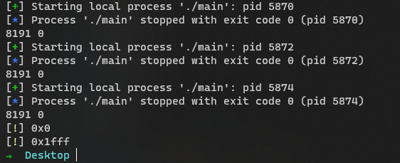

# BeapOverflow (Bss Overflow -> Heap Overflow)

This is a finding for address randomization. There could be no gap between the bss segment and the heap area.

It's not a secure design since people can overflow from bss to heap and partially write important data on the tcache management structure. 

We can brute force 0x1fff times (excepted) to perform BeapOverflow.

This trick is even feasible for recent glibc, which implemented safe linking.

But we need to overflow at least more than one page on bss, which is rare.

# PoC
- Compile the c coude: [main.c](./main.c)
- Run the python script several times to see the range of the offset: [exp.py](./exp.py)

# Max Range in Test
0 - 0x1fff

# Source Code Reading
I locate the file after reading this [article][1] and the source code confirmed the correctness of my code:

https://elixir.bootlin.com/linux/v4.11.4/source/drivers/char/random.c#L2089

https://elixir.bootlin.com/linux/v4.11.4/source/arch/x86/kernel/process.c#L476

And I'll try to create an issue for linux kernel to see if the developers think it's a bug.

[1]: https://www.cnblogs.com/wangaohui/p/7122653.html
